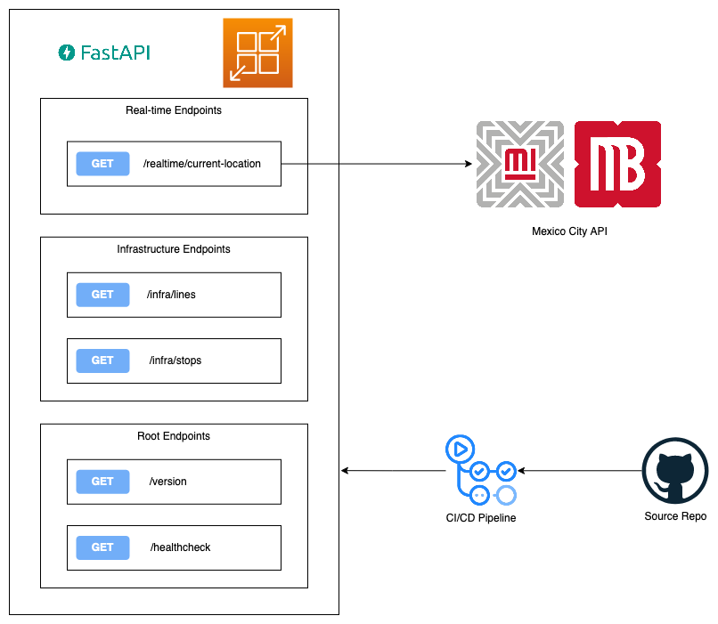

# Metrobus Data API

As always, I have way too many side projects, and this morning I felt that my previous attempt to process data from one of Mexico City's most important public transportation method deserved more love. [The Mexico City data page](https://datos.cdmx.gob.mx/) has gone through a fair share of changes over the last couple of years, in my lazyness not wanting to actively maintain a code base that uses an API that might introduce breaking changes from one day to the other, I decided to put this project in the freezer.

For a while now it appears that changes have slowed down, and that the devs for the Mexico City data page have settled on a more long-term version of the page. And that was reason enough to decide and give this project another try.

## What the project attemps

My goal for this project is creating a backend that's basically a wrapper around the Mexico City Metrobus public endpoints, which serve data in the [General Transit Feed Specification standard (GTFS)](https://gtfs.org/). This API will query the data and transform it into the [GeoJSON standard](https://geojson.org/).

Why GeoJSON? Mainly because it's a much more common geospatial data format, and in the future I want to make a really simple web app to show this data in a map.

## How it's built

This project uses [poetry](https://python-poetry.org/) for dependency management. The web framework we're using is the popular [FastAPI](https://fastapi.tiangolo.com/).

## Local DEV

In case someone wants to run a local version of the app or, what's the most likely scenario, for future me, this is how the project is run.

```sh
poetry install
poetry run pytest -v
poetry run uvicorn app.main:app --reload
```

> **NOTE:** There are two variables needed for configuration, `MB_USERNAME` and `MB_PASSWORD`, these can be set as environment variables or in a `.env` file

## App Infrastructure



## Future dev ideas

These are some high-level milestiones (not necessarily in order of priority), for the project:

- [x] Write tests for the code
- [x] Build endpoint to transform realtime location to GeoJSON
- [x] Build endpoints to return the Metrobus lines and stops in GeoJSON
- [x] Dockerize the app
- [ ] Develop authentication for the API
- [x] Deploy app in [aws apprunner](https://aws.amazon.com/apprunner/)
- [ ] Github Actions CI/CD pipeline
- [ ] Package app into python package and publish to aws codeArtifact
